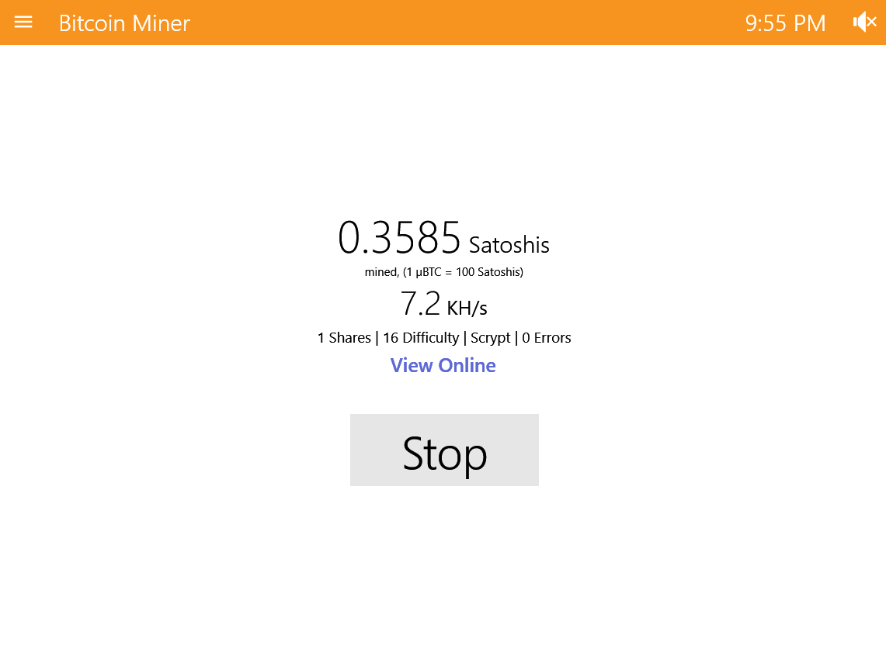
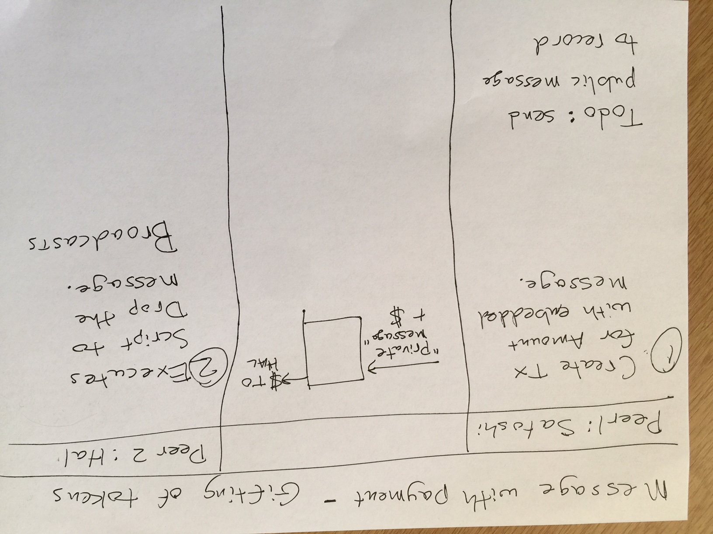
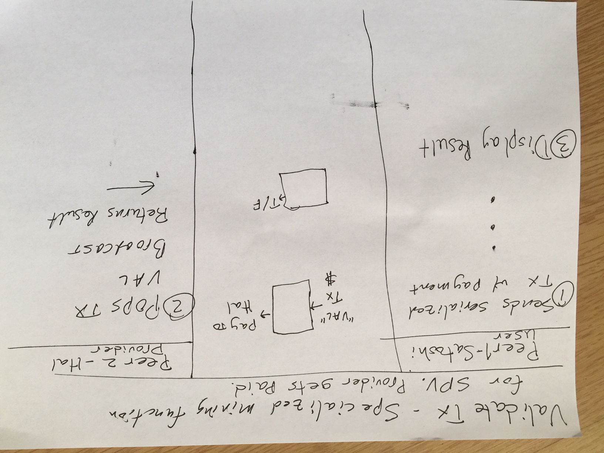
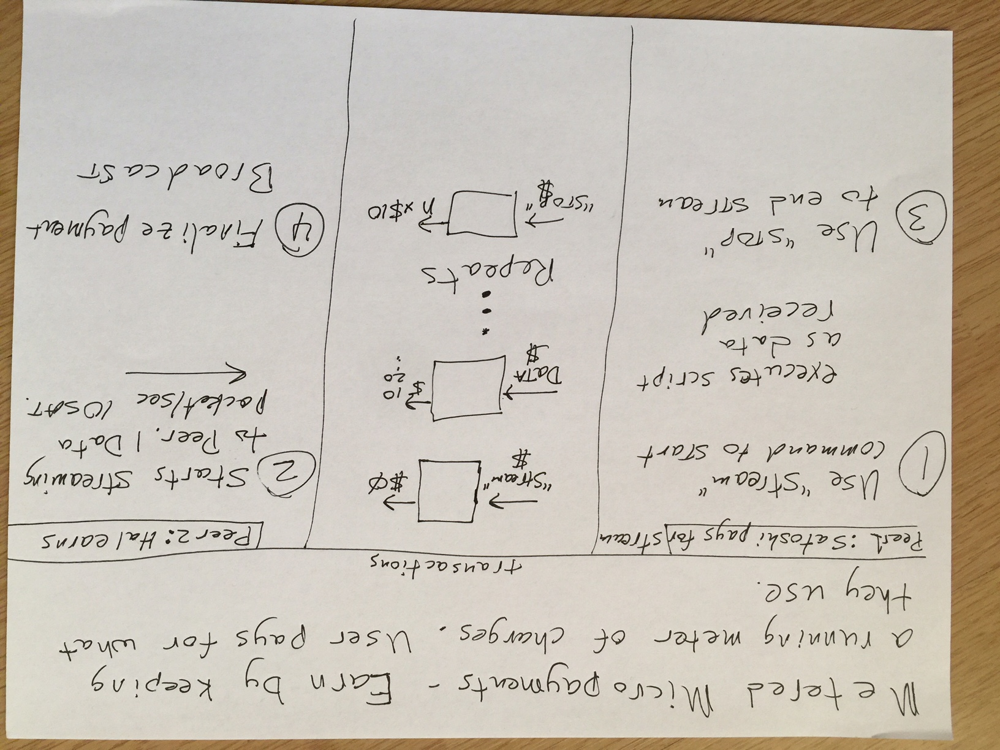

# P2P Channels

P2P offers a third paradigm for application architecture. Traditional centralized web programming relies on a web server and database to deliver content (https://wiki.p2pfoundation.net/Centralized_Web). More recently, BSV apps load content from the blockchain, i.e. blockchain as a content delivery system. In comparison, P2P follows a distinctive paradigm distinguished by direct P2P communication and serving content from a peer computer. It is a different animal and deserves thoughtful consideration as to its peculiarities. A careful study of this project illuminates some of those differences.

# Market Fit
Numerous opportunities abound for making P2P channel solutions. The following items touch on just some of the revenue possibilies.

### P2P marketplaces
Users need to discover peers that provide the services that they are interested in (Providers). That is the role of a marketplace. A marketplace/oracle may also earn money as an arbitrator in cases where escrow services are needed. Providers earn money in the marketplace by providing services to users.

One example of a marketplace platform is https://district0x.io/

### Other examples
I do not endorse any of these but present them to give a flavor of what is out there in the P2P realm.  
- Distributed Exchanges: https://bisq.network/  
- OpenBazaar: https://openbazaar.org/  
- IOT devices: https://medium.com/@philippsandner/blockchain-business-models-for-autonomous-iot-sensor-devices-2732a489f28d

# UI Design
Obviously, not much time was put into creating a UI for this hack since it is so early in the development cycle and few libraries exist to accelerate development of these types of applications.

The existing command line interface as shown is perfect for debugging P2P scenarios, watching the transactions as they are exchanged between peers. Basic channel data transfer and channel accounting takes higher precedence over UI at this point in development. However, I have put in some time thinking about what the UI should look like for various scenarios.

Example 1: For simple payment transfers moneybutton would be the obvious choice. Integration with the MB Auth system would be an obvious enhancement so it would immediately know your identity.

Example 2: For Providers earning revenue for performing calculations the UI would be minimal. A simple display of running statistics and a stop/start button would suffice. It could be similar to this mining interface.

Example 3: Metered usage. Mostly users will want no UI, just a summary of charges when you settle up the channel. What users would want is for the payment channel to know who you are and understand your preference about when to get notified. For example, when the cost of the payment channel is nearing whatever limits you supply then it would escalate the alerts to notify you of the pending channel shut down. Similar to the battery charge indicator on your laptop.

In general, these p2p channels will become so pervasive they will be nearly invisible. A rules engine will know your policies and preferences and alert you whenever you need to be alerted.

# Project design documents

## Example 1: Simple Gift of cash using p2p  

## Example 2: Provider earning using p2p  

## Example 3: Stream micropayment using p2p  

# Background material
The following links provide some background into the concepts used in this hack.

Using OP_DROP.  
https://medium.com/@craig_10243/the-start-of-metanet-ef0560e81505

Ryan on Payment channels and malleability.  
https://www.youtube.com/watch?v=S6rd1KbF7sc

Mining specialization.   
https://www.youtube.com/watch?v=8_SoIXUBIhw&feature=youtu.be

scriptSig malleation. Payment channels.  
https://www.finder.com.au/craig-wright-on-spv-im-sick-of-people-not-getting-it

